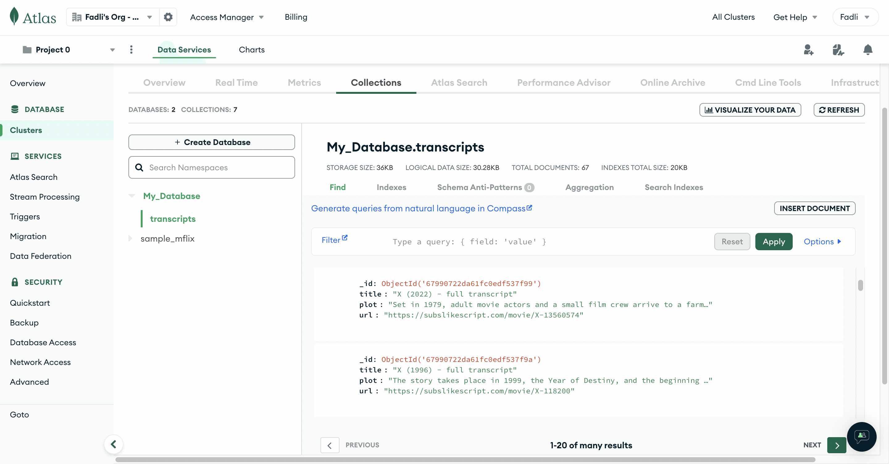

# Web Scraping in Python using Beautifulsoup, Selenium, and Scrapy

## Introduction 
This project aims to perform web-scraping in Python using familiar library such as Beautifulsoup, Selenium, and Scrapy. 

Executive summary: 

🔧 What I do:

    🍲 Project 1.1: Introduction to Beautiful Soup 
      - Create a code to scrap a web in a single page 
    🍲 Project 1.2: Scraping Multiple Pages with Beatifulsoup
      - Create a code to scrap a web in multiple pages
    🔄 Project 2.1: Introduction to Selenium
      - Setup ChromeDriver 
      - Handling 'Click' on a button on the website 
      - Handling 'Dropdown' Selection on the website 
      - Extracting data from a Table and exporting data to a CSV file with 🐼 Pandas 
    🔄 Project 2.2: Dealing with Multiple Pages Using Selenium
      - Handling Headless Mode 
      - Handling Pagination Cases 
      - Explicit Wait
    🐍 Project 3.1: Introduction to ScraPy
      - Scrapy installation 
      - Create a new project and spider 
      - Scrapy templates 
      - Scrapy commands and scrapy shell commands 
      - Get a link listed in website 
      - Absolute and relative links 
      - Scraping data from multiple links 
    🐍 Project 3.2: Audible Project
      - Create a new project audible.com 
      - Dealing with multiple pages using Scrapy 
      - Changing user-agent 
    🐍 Project 3.3: Movie Transcripts Project and Dealing with Database
      - Create a new project subslikescript.com
      - Dealing with multiple pages using Scrapy 
      - Changing user-agent 
      - Create a Pipeline
      - Connect and Export Data into MongoDB

 
<em>Connect and Export into MongoDB Result</em>

      - Export Data into SQLite
 
<em>Export into SQLite Result</em>

    🐍 Project 3.4: Scraping API and Login to Website with Scrapy
      - Create a new project for Scraping API
      - Dealing with Pagination in API
      - Login into Website using Scrapy

